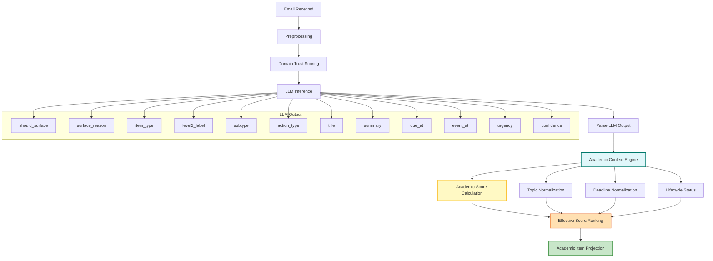

# Academic Items & Academic Context Engine

## Overview
This document explains the logic and flow for academic item extraction, scoring, and projection in Uni-Dash, focusing on the Academic Context Engine and its integration with LLM outputs.

---

## High-Level Flow



---

## LLM Output Schema
The LLM is prompted to return a compact JSON object with these keys:
- `should_surface`: bool
- `surface_reason`: str
- `item_type`: str (e.g., ASSIGNMENT, EXAM, EVENT, OPPORTUNITY, ADMIN_TASK, ANNOUNCEMENT, NONE)
- `level2_label`: str (e.g., "Assignment or Submission", "Exam Notifications", ...)
- `subtype`: str (e.g., HACKATHON, INTERNSHIP, ...)
- `action_type`: str (e.g., SUBMIT, REGISTER, ...)
- `title`: str
- `summary`: str
- `due_at`: ISO 8601 or null
- `event_at`: ISO 8601 or null
- `urgency`: str (Critical, High, Medium, Low, None)
- `confidence`: str (High, Medium, Low, None)

---

## Academic Context Engine Responsibilities
1. **Topic Normalization**
   - Maps LLM `level2_label` or `item_type` to canonical ontology (e.g., "Assignment or Submission" → ASSIGNMENT).
2. **Deadline Normalization**
   - Validates and normalizes deadlines, rejecting past/absurd dates.
3. **Academic Score Calculation**
   - Combines deadline urgency, topic, source trust, AI urgency, and time decay into a 0–100 score.
   - Formula:
     - Deadline urgency: 0–35 (proximity)
     - Topic importance: 0–30 (ontology weight)
     - Source trust: 0–25 (from DomainTrustScorer)
     - AI urgency: 0–7 (tiebreaker)
     - Time decay: 0–3 (recency)
4. **Lifecycle Status**
   - Manages item status (active, completed, missed, ignored, expired, needs_review).
5. **Effective Score/Ranking**
   - Applies decay, urgency, and signal boosts for ranking and surfacing.
6. **Projection**
   - Creates AcademicItem/FollowUp objects for dashboard and reminders.

---

## Parameters & Calculation Details
- **Deadline Urgency**: Based on hours to deadline (≤6h: 35, ≤24h: 30, ≤3d: 25, ≤1w: 15, else 5)
- **Topic Importance**: Mapped from normalized topic (e.g., EXAM: 30, ASSIGNMENT: 27, ...)
- **Source Trust**: 0–25, from sender domain trust profile
- **AI Urgency**: "Critical"=7, "High"=5, "Medium"=3, "Low"=1, "None"=0 (only if no deadline)
- **Time Decay**: Up to 3 points, decays with age

---

## Example
```json
{
  "should_surface": true,
  "surface_reason": "assignment deadline",
  "item_type": "ASSIGNMENT",
  "level2_label": "Assignment or Submission",
  "subtype": "NONE",
  "action_type": "SUBMIT",
  "title": "Submit Lab Report",
  "summary": "Lab report submission due tomorrow.",
  "due_at": "2026-04-26T23:59:00Z",
  "event_at": null,
  "urgency": "High",
  "confidence": "High"
}
```

---

## References
- `app/services/ai_service.py` (LLM prompt, parsing, field mapping)
- `app/services/academic_context_engine.py` (scoring, normalization, projection)
- `app/services/domain_trust_scorer.py` (source trust)
