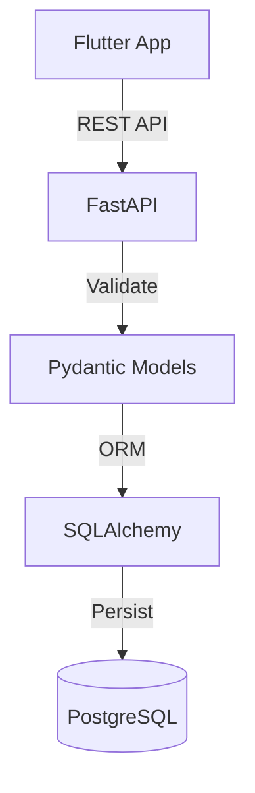

# Uni-Dash Reborn Backend

This is the FastAPI backend for the Uni-Dash Reborn application.

## Architecture



## Setup

1.  **Environment Variables**: Ensure you have a `.env` file in the `backend` directory with:
    - `USER_DATABASE_URL`
    - `CLIENT_ID`, `CLIENT_SECRET` (Google OAuth)
    - `BACKEND_REDIRECT_URI`
    - `ENCRYPTION_KEY`

2.  **Dependencies**:
    ```bash
    pip install -r requirements.txt
    ```

3.  **Run Locally**:
    ```bash
    uvicorn app.main:app --host 0.0.0.0 --port 8000 --reload
    ```

## Key Directories

- `app/routers`: API endpoints
- `app/services`: Business logic
- `app/models`: Database models
- `app/jobs`: Background jobs (e.g., Gmail sync)