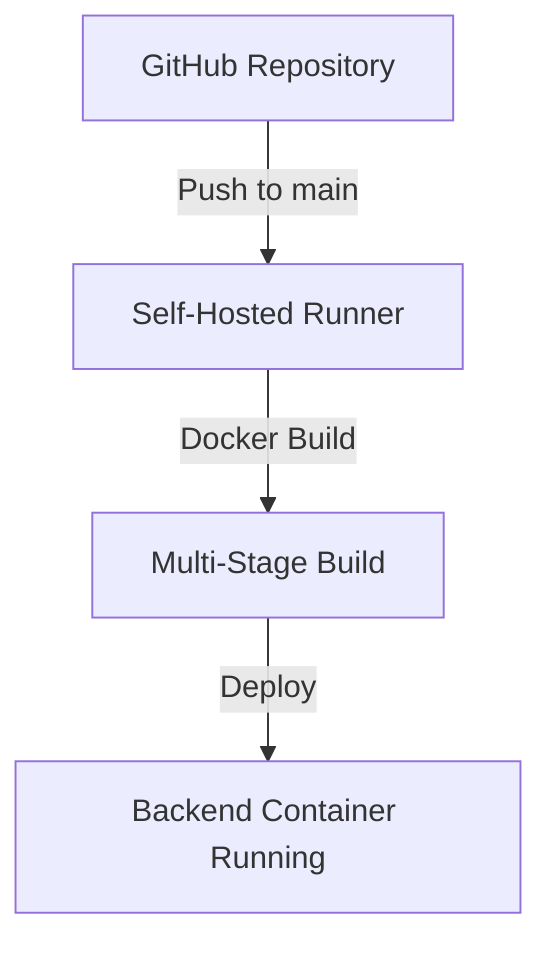
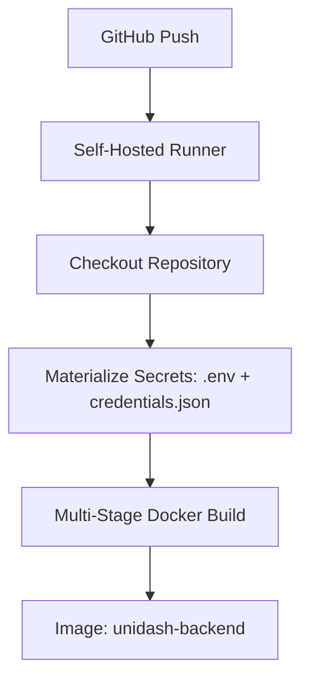
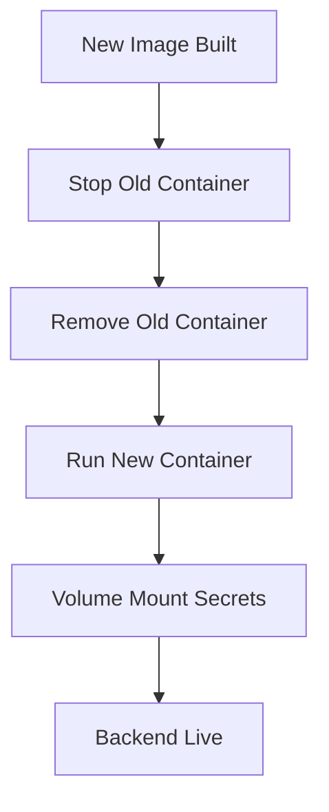
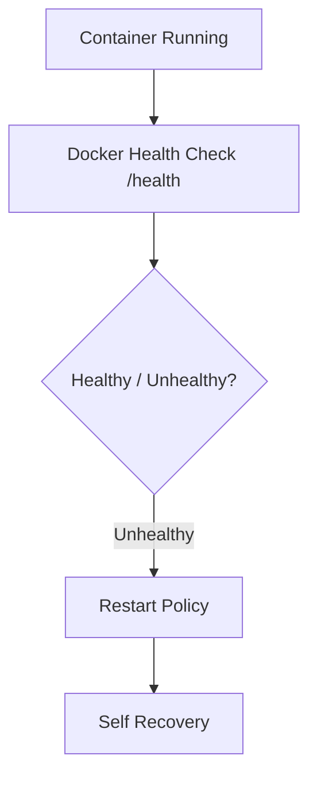

# Uni-Dash: Backend CI/CD Pipeline Documentation

This document outlines the architecture, implementation, and maintenance of the Uni-Dash backend deployment pipeline. Instead of using cloud CI infrastructure, Uni-Dash deploys directly from GitHub to a Raspberry Pi using a self-hosted runner.

---

## 1. Deployment Overview (Slide 1)

"Every push to main triggers a self-hosted GitHub runner on the Raspberry Pi which builds and redeploys the backend container."



### Context
The backend deployment pipeline for Uni-Dash was designed to run entirely on a self-hosted environment using a Raspberry Pi. This creates a reproducible, containerized system while ensuring that sensitive credentials never enter the repository or Docker image.

---

## 2. Continuous Integration (CI) Pipeline (Slide 2)

Focuses on producing a runnable container image from source.



### Key Highlights
- **ARM Optimization**: Build process utilizes `piwheels.org` to fetch pre-compiled ARM wheels, avoiding slow compilation of scientific Python packages.
- **Multi-Stage Docker Build**: Separates the build-time dependencies from the runtime environment to keep the final image lean.
- **Local Execution**: All build operations occur directly on the Raspberry Pi hardware, ensuring platform compatibility.

---

## 3. Continuous Deployment (CD) Pipeline (Slide 3)

Focuses on the deployment lifecycle and container management.



### Key Highlights
- **Atomic Replacement**: Old containers are stopped and removed before the new version is launched to ensure clean state.
- **Volume Mount Secrets**: Sensitive files (`.env`, `credentials.json`) are mounted from the host at runtime, preventing them from being baked into the image layers.
- **Restart Policy**: Configured with `--restart unless-stopped` to recover automatically from crashes or system reboots.

---

## 4. Reliability & Monitoring (Slide 4)

Focuses on runtime behavior and self-healing.



### Key Highlights
- **Health Checks**: Specialized `/health` endpoint monitors background workers and API health.
- **Self-Healing**: Docker monitors the health status and automatically triggers restarts based on the defined policy.

---

## 5. Implementation Code

### 5.1 Dockerfile (Multi-Stage ARM)
```dockerfile
# ---- Builder stage ----
FROM --platform=linux/arm/v7 python:3.11-slim-bookworm AS builder
WORKDIR /backend
RUN pip install --upgrade pip && \
    pip config set global.extra-index-url https://www.piwheels.org/simple
COPY requirements.txt .
RUN pip install --no-cache-dir --user -r requirements.txt

# ---- Runtime stage ----
FROM --platform=linux/arm/v7 python:3.11-slim-bookworm
WORKDIR /backend
RUN apt-get update && apt-get install -y libpq5 && rm -rf /var/lib/apt/lists/*
COPY --from=builder /root/.local /root/.local
ENV PATH=/root/.local/bin:$PATH
COPY app ./app
EXPOSE 8000
CMD ["uvicorn", "app.main:app", "--host", "0.0.0.0", "--port", "8000"]
```

### 5.2 GitHub Actions Workflow
```yaml
- name: Start new container
  run: |
    docker run -d \
    --name unidash-backend \
    --restart unless-stopped \
    -p 8000:8000 \
    --health-cmd "curl -f http://localhost:8000/health || exit 1" \
    --health-interval 30s \
    --health-timeout 10s \
    --health-retries 3 \
    -v ${{ github.workspace }}/backend/.env:/backend/.env \
    -v ${{ github.workspace }}/backend/credentials.json:/backend/app/core/credentials.json \
    unidash-backend
```

---

## 6. Setup & Maintenance (Self-Hosted Runner)

### 6.1 Prerequisites
- **Device**: Raspberry Pi (ARM).
- **Directory**: `~/actions-runner`.

### 6.2 Resetting the Runner
If the runner identity is invalidated:
1. `cd ~/actions-runner`
2. `sudo ./svc.sh stop && sudo ./svc.sh uninstall`
3. `./config.sh remove` (or `rm -f .runner .credentials`)
4. Re-register on GitHub Settings.
5. `sudo ./svc.sh install && sudo ./svc.sh start`

### 6.3 Monitoring
- Check status: `sudo ./svc.sh status`
- Verify persistence: `systemctl is-enabled actions.runner.*.service`