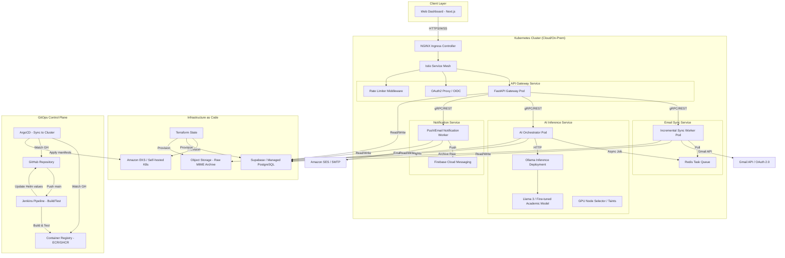
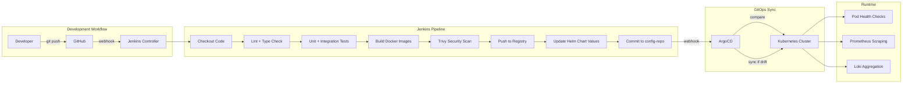
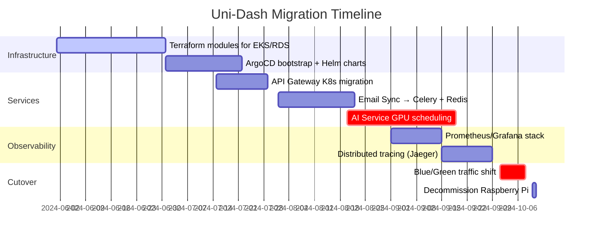

# Uni-Dash: AI-Powered Academic Email Platform [WIP]

> **Work in Progress — Target Architecture Branch**  
> This branch represents the migration path from a monolithic Raspberry Pi deployment to a cloud-native, fully decoupled microservices architecture. The current implementation (see `main` branch) remains functional; this branch tracks the evolution toward production-grade infrastructure.

---

## Target System Vision

Uni-Dash is evolving into a distributed, cloud-native platform designed for scalability, resilience, and GitOps-driven operations. The target system decouples all concerns into independently deployable services orchestrated via Kubernetes, with infrastructure defined as code.



---

## Architecture Evolution

### Current Implementation (`main` branch)
| Component | Technology | Location |
|-----------|-----------|----------|
| Frontend | Flutter | Client device |
| API Broker | FastAPI + asyncio | Raspberry Pi (ARM) |
| Email Sync | Polling worker | Raspberry Pi |
| AI Inference | Ollama + Llama 3 | Dedicated GPU machine (LAN) |
| Database | Supabase PostgreSQL | Cloud-managed |
| Deployment | Docker + GitHub Actions (self-hosted runner) | Raspberry Pi |

### Target Architecture (This Branch)
| Component | Technology | Deployment Target |
|-----------|-----------|------------------|
| Frontend | Next.js 14 (App Router) + Python SDK | Vercel / CDN |
| API Gateway | FastAPI + Istio sidecar | Kubernetes Pod |
| Email Sync Service | Celery + Redis Queue | Kubernetes Deployment (HPA) |
| AI Inference Service | FastAPI + Ollama + GPU scheduler | Kubernetes StatefulSet (GPU nodes) |
| Notification Service | Async worker + FCM/SES | Kubernetes CronJob/Deployment |
| Database | Supabase / Cloud SQL | Managed external |
| Object Storage | S3-compatible | Cloud storage |
| Service Mesh | Istio / Linkerd | Kubernetes |
| Ingress | NGINX Ingress Controller | Kubernetes |
| Secrets | External Secrets Operator + Vault | Kubernetes |
| Observability | Prometheus + Grafana + Loki | Kubernetes monitoring stack |

---

## DevOps & Infrastructure Pipeline

### Infrastructure as Code (Terraform)
```hcl
# modules/kubernetes/main.tf
module "eks_cluster" {
  source  = "terraform-aws-modules/eks/aws"
  version = "~> 19.0"
  
  cluster_name    = "unidash-prod"
  cluster_version = "1.28"
  
  # GPU node group for AI workloads
  node_groups = {
    gpu-inference = {
      instance_types = ["g4dn.xlarge"]
      taints = {
        dedicated = "gpu:NoSchedule"
      }
      labels = {
        workload-type = "ai-inference"
      }
    }
    
    # General purpose node group
    general = {
      instance_types = ["t3.medium"]
    }
  }
}

# modules/supabase/main.tf
resource "supabase_project" "unidash" {
  name = "unidash-production"
  region = "us-east-1"
}
```

### CI/CD Pipeline Architecture


### Key DevOps Components
| Tool | Purpose | Stage |
|------|---------|-------|
| Terraform | Provision EKS, RDS, S3, IAM roles | Infrastructure |
| Jenkins | Build, test, scan, and package artifacts | CI |
| ArgoCD | GitOps sync of Helm releases to cluster | CD |
| Helm | Package Kubernetes manifests with environment values | Packaging |
| Trivy | Container vulnerability scanning | Security |
| External Secrets | Sync secrets from Vault/AWS Secrets Manager | Security |
| Istio | mTLS, traffic splitting, observability | Service Mesh |
| Prometheus/Grafana | Metrics collection and dashboards | Observability |
| Loki | Log aggregation | Observability |

---

## Component Breakdown (Target)

### 1. Frontend Layer (Next.js + Python)
- **Next.js 14 Web Dashboard**: App Router, Server Components, SSR for SEO, PWA capabilities
- **Python SDK**: Shared OpenAPI-generated client for API contracts, used by both frontend and backend services
- **Authentication**: NextAuth.js with OIDC provider, session management via secure HTTP-only cookies
- **State Management**: React Query for server state, Zustand for client state
- **Styling**: Tailwind CSS with design tokens, dark mode support

### 2. API Gateway Service
- FastAPI with async endpoints
- Istio sidecar for mTLS, retries, circuit breaking
- OAuth2 Proxy for OIDC authentication flow
- Rate limiting per user/API key
- OpenAPI 3.0 spec auto-generated and published

### 3. Email Sync Service
- Celery workers pulling from Redis queue
- Incremental sync using Gmail `historyId` with exponential backoff
- MIME parsing with fallback strategies (text/plain -> text/html -> BeautifulSoup)
- Raw MIME archival to S3 for audit/compliance
- Dead-letter queue for unparseable emails

### 4. AI Inference Service
- Stateless orchestrator pod that dequeues jobs from Redis
- GPU node affinity/taints to schedule only on GPU-equipped nodes
- Ollama deployed as a sidecar or separate deployment with persistent model cache
- Prompt templating with academic context injection
- Structured JSON output validation via Pydantic
- Fallback to rule-based classifier if Ollama is unreachable

### 5. Notification Service
- Listens to database change events (Supabase Realtime or Debezium)
- Batches notifications to avoid spam
- Integrates with FCM (mobile push) and SES (email fallback)
- User preference filtering (quiet hours, topic filters)

### 6. Observability Stack
- **Metrics**: Prometheus exporters on each service, custom business metrics (emails processed/min, AI latency p95)
- **Tracing**: Jaeger/OpenTelemetry for distributed request tracing
- **Logging**: Structured JSON logs shipped to Loki, correlated via trace IDs
- **Alerting**: Alertmanager rules for SLO breaches (e.g., sync lag > 5min, AI error rate > 1%)

---

## Getting Started (Target Branch)

> This branch is under active development. Components may not be fully functional yet.

### Prerequisites (Target)
```bash
# Infrastructure
- Terraform >= 1.6
- kubectl + AWS CLI / gcloud
- Helm >= 3.12
- ArgoCD CLI (optional)

# Development
- Python 3.11 + uv/poetry
- Node.js 18+ (for Next.js frontend)
- Docker + Buildx (for multi-arch builds)
```

### Local Development Workflow
```bash
# 1. Provision local Kubernetes (kind/k3d)
make cluster-up  # Uses kind with GPU emulation (CPU fallback)

# 2. Deploy dependencies
make deploy-deps  # Installs Istio, Prometheus, Redis, ArgoCD

# 3. Build and load images
make build-images LOAD=true  # Loads images into kind cluster

# 4. Deploy application stack
make deploy-app ENV=dev  # Applies Helm charts with dev values

# 5. Access services
make port-forward  # Exposes API gateway at localhost:8000

# 6. Run Next.js frontend against local API
cd frontend/web && npm run dev -- --port 3000
```

### Terraform Workflow
```bash
cd infra/terraform

# Initialize and plan
terraform init
terraform plan -var-file=envs/prod.tfvars

# Apply (requires approved PR + manual confirmation)
terraform apply -var-file=envs/prod.tfvars

# Output kubeconfig for kubectl
terraform output -raw kubeconfig > ~/.kube/unidash-prod
```

### ArgoCD Bootstrap
```bash
# Install ArgoCD (if not already present)
kubectl apply -n argocd -f https://raw.githubusercontent.com/argoproj/argo-cd/stable/manifests/install.yaml

# Bootstrap the root application
kubectl apply -f argocd/root-app.yaml

# Access UI
kubectl port-forward svc/argocd-server -n argocd 8080:443
# Login with admin password from:
kubectl get secret argocd-initial-admin-secret -n argocd -o jsonpath="{.data.password}" | base64 -d
```

---

## Security & Compliance (Target)

- **Secrets Management**: External Secrets Operator syncs from AWS Secrets Manager / HashiCorp Vault; no secrets in Git or image layers
- **Network Policies**: Default-deny Kubernetes NetworkPolicies; Istio AuthorizationPolicies for service-to-service RBAC
- **Pod Security**: Pod Security Admission (restricted profile), seccomp, read-only root filesystems
- **Supply Chain**: Sigstore cosign for image signing, SLSA-compliant build pipeline
- **Data Protection**: OAuth tokens encrypted at rest (Fernet + KMS); PII fields masked in logs
- **Audit**: Kubernetes audit logs shipped to S3 + Athena for compliance queries

---

## Migration Roadmap



---

## Documentation

- [Architecture Decision Records (ADRs)](./docs/adr/)
- [API Contract (OpenAPI)](./api/openapi.yaml)
- [Helm Chart Values Reference](./charts/unidash/README.md)
- [Terraform Module Docs](./infra/terraform/modules/README.md)
- [Runbook: Incident Response](./docs/runbooks/)

---

## Contributing

This branch follows trunk-based development with feature flags. All changes require:
1. PR with linked issue
2. Passing Jenkins pipeline (lint, test, scan)
3. ArgoCD sync preview in staging environment
4. Approval from >=1 maintainer

See [CONTRIBUTING.md](./CONTRIBUTING.md) for detailed guidelines.

---

Built to simplify the student experience through resilient, cloud-native systems engineering.