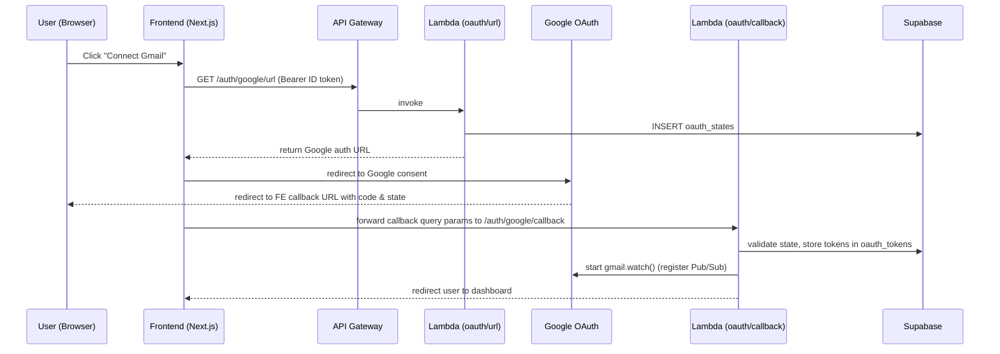

# Uni-Dash: AI-Powered Academic Email Platform

**Status:** Phase 1 complete — Auth, profile management, and Gmail OAuth implemented on AWS Serverless

---

## Overview

This repository contains the backend and frontend for Uni-Dash, a serverless academic dashboard that enhances email and classroom triage of educational institutes.

the project is moving from a monolihtic fast api backend to serverless architecture on lambda + api-gateway + event implementations soon.

constraints to be addressed: hosted database solutions on aws is still costly for my development phase. so i am sticking to supabase. and i tried implementing cognito idp to support google oauth token exchange in aws natively. but it doesnt work like i expected it to. so i am sticking to google console provider for the project setup.

---

## Implementation status

Completed components

- User authentication (AWS Cognito + HTTP API JWT authorizer) — `POST /auth/*`
- Profile creation, retrieval, update (Lambda + Supabase REST) — `POST|GET|PUT /user/profile`
- Gmail OAuth URL endpoint (Lambda) — `GET /auth/google/url`
- Gmail OAuth callback (Lambda) — `GET /auth/google/callback`
- Gmail disconnect (Lambda) — `POST /auth/google/disconnect`
- Gmail watch (gmail.watch() via Lambda) — triggered on OAuth connect
- Webhook receiver for Pub/Sub push (Lambda) — `POST /gmail/webhook`
- Frontend (Next.js 14 App Router + Cognito) — `localhost:3000` during development
- IaC (AWS SAM) — `template.yaml`

In progress / next items

- Gmail email sync worker (Lambda triggered by history_id updates)
- AI classification worker (external Ollama worker polling Supabase)
- Frontend deployment to S3 + CloudFront
- Pub/Sub push subscription pointing to the webhook Lambda URL
- Observability: CloudWatch alarms + X-Ray

---

## Architecture (high-level)

```mermaid
flowchart LR
  A[Next.js Frontend] --> B[AWS Cognito]
  B --> C[API Gateway (HTTP API) - JWT Authorizer]
  C --> D[Lambda Functions]
  subgraph Lambdas
    D1[GET /auth/google/url]
    D2[GET /auth/google/callback]
    D3[POST /auth/google/disconnect]
    D4[POST /gmail/webhook]
    D5[GET/POST/PUT /user/profile]
  end
  D --> E[Supabase (Postgres)]
  E --> F[Tables: users, oauth_tokens, oauth_states, gmail_sync_status]
  D2 --> G[Google OAuth]
  G --> H[Google Pub/Sub]
  H --> D4
```

---

## Infrastructure (selected resources)

- Cognito User Pool: `ap-south-1_ZX4Mgtd7P` (ap-south-1)
- API Gateway (HTTP API): `unidash-backend` (ap-south-1)
- CloudFormation / SAM stack: `unidash-backend`
- SAM S3 bucket: aws-sam-cli-managed-default-samclisourcebucket-*

### Key Lambdas (names and code locations)

- `unidash-profile-api` — `backend_code/auth/lambda_function.py` (protected)
- `unidash-oauth-url` — `backend_code/oauth/url/lambda_function.py` (protected)
- `unidash-oauth-callback` — `backend_code/oauth/callback/lambda_function.py` (public)
- `unidash-oauth-disconnect` — `backend_code/oauth/disconnect/lambda_function.py` (protected)
- `unidash-gmail-webhook` — `backend_code/gmail/webhook/lambda_function.py` (public, secret-validated)

### SSM parameters (prefix `/unidash/dev/`)

- `supabase/url`
- `supabase/sevice_key` (secure)
- `allowed_origins`
- `frontend_url`
- `gcp/client_id` (secure)
- `gcp/client_secret` (secure)
- `fernet_key` (secure)
- `pubsub_topic`
- `webhook_secret` (secure)

---

## Code layout

```text
AWS_Migration_Codebase/
├─ template.yaml
├─ backend_code/
│  ├─ auth/ (profile Lambda)
│  ├─ oauth/
│  │  ├─ url/
│  │  ├─ callback/
│  │  └─ disconnect/
│  └─ gmail/
│     └─ webhook/
└─ web/ (Next.js frontend)
   └─ src/app/
       ├─ profile/
       └─ auth/google/callback/ (frontend handler)
```

---

## OAuth flow (sequence)



---

## Deployment

From the `AWS_Migration_Codebase/` directory:

```bash
sam build
sam deploy --capabilities CAPABILITY_NAMED_IAM
# For first-time interactive setup:
sam deploy --guided --capabilities CAPABILITY_NAMED_IAM
```

---

## OAuth callback routing note

During development the frontend hosts the callback route at `/auth/google/callback` which forwards the browser to the backend Lambda at `/auth/google/callback`. Ensure `NEXT_PUBLIC_API_BASE_URL` is set (e.g. `http://localhost:8000`) when running locally so the frontend can forward to the API.

---

## Next steps

- Create the Pub/Sub push subscription pointing at `POST /gmail/webhook?token=<webhook_secret>`
- Implement the Gmail sync Lambda that reads `last_history_id` and ingests messages
- Deploy the frontend to S3 + CloudFront and update `frontend_url` SSM parameter and GCP redirect URIs
- Add a renewal mechanism for `gmail.watch()` (expires weekly)

---

## Known limitations

- `frontend_url` is currently set to `http://localhost:3000` in dev SSM param — update for production
- Gmail watch expires and requires renewal
- Ollama worker is external and not yet integrated into AWS

---

If you want different diagrams (architecture, sequence, or file tree) or prefer the README split into a short `README.md` and a longer `docs/ARCHITECTURE.md`, tell me which pieces to expand.
